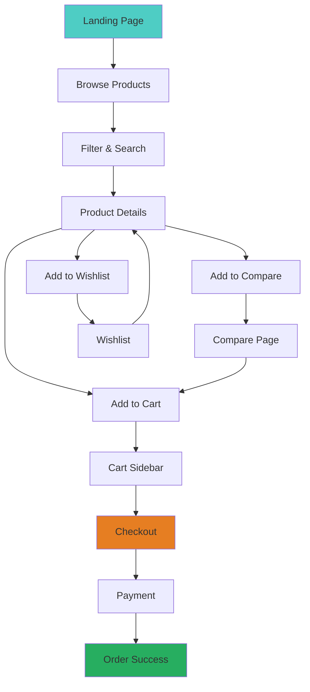

# Malisek Tech Solutions - E-commerce Platform

A modern, responsive Progressive Web App (PWA) for electronics and technology products built with React, TypeScript, and Tailwind CSS.


## 🚀 Technologies Used

- **Frontend Framework**: React 18 with TypeScript
- **Build Tool**: Vite
- **Styling**: Tailwind CSS with custom design system
- **UI Components**: shadcn/ui with custom variants
- **State Management**: Zustand for cart and app state
- **Routing**: React Router v6
- **Animations**: Framer Motion
- **Theme**: Next-themes for dark/light mode
- **Data Fetching**: TanStack Query (React Query)
- **Icons**: Lucide React
- **PWA**: Service Worker with installable manifest

## 🎨 Design System

The app uses a cohesive design system based on Malisek Tech's brand colors:

- **Primary**: Teal (#4ECDC4) - Modern tech aesthetic
- **Secondary**: Navy (#2C3E50) - Professional depth
- **Accent**: Light teal variations for highlights
- **Typography**: Clean, modern font stack
- **Components**: Custom shadcn/ui variants with semantic tokens

## 📱 Features

### Core E-commerce Features
- **Product Catalog**: Browse electronics, phones, computers, wearables, office tech
- **Advanced Filtering**: Category, brand, price range, rating, availability filters
- **Product Search**: Real-time search with autocomplete
- **Product Details**: Multiple images, variations, reviews, specifications
- **Shopping Cart**: Persistent cart with quantity management
- **Wishlist**: Save products for later
- **Product Comparison**: Compare up to 6 products side-by-side
- **Checkout Process**: Multi-step checkout with payment options

### UI/UX Features
- **Responsive Design**: Mobile-first approach, works on all devices
- **Progressive Web App**: Installable, works offline
- **Dark/Light Theme**: Toggle between themes
- **Smooth Animations**: Cart animations, page transitions, hover effects
- **Loading States**: Shimmer effects for better UX
- **Toast Notifications**: User feedback for actions

### Layout Components
- **Sticky Header**: Ads strip + navigation with search
- **Filter Sidebar**: Collapsible left sidebar with comprehensive filters
- **Cart Sidebar**: Right sidebar that appears when items are added
- **Hero Carousel**: Featured products with animated overlays
- **Product Sections**: Popular, featured, and promoted product rows

## 🛒 Customer Journey



## 🏗️ Project Structure

```
src/
├── components/
│   ├── layout/           # Header, Footer, Sidebars
│   ├── product/          # Product cards, grids
│   ├── home/            # Homepage components
│   └── ui/              # shadcn/ui components
├── pages/               # Route components
├── store/               # Zustand stores
├── data/                # Static data and types
├── hooks/               # Custom React hooks
└── lib/                 # Utilities and helpers
```

## 🚀 Getting Started

### Prerequisites
- Node.js 18+ and npm
- Modern web browser

### Installation

1. **Clone the repository**
   ```bash
   git clone <YOUR_GIT_URL>
   cd malisek-tech-solutions
   ```

2. **Install dependencies**
   ```bash
   npm install
   ```

3. **Start development server**
   ```bash
   npm run dev
   ```

4. **Build for production**
   ```bash
   npm run build
   ```

5. **Preview production build**
   ```bash
   npm run preview
   ```

### Development Scripts

- `npm run dev` - Start development server
- `npm run build` - Build for production
- `npm run preview` - Preview production build
- `npm run lint` - Run ESLint
- `npm run type-check` - Run TypeScript checks

## 🎯 Key Features Implementation

### Shopping Cart
- Persistent storage with Zustand + localStorage
- Real-time updates with animations
- Quantity management and variation support
- Automatic cart opening on item addition

### Product Filtering
- Multi-criteria filtering (category, brand, price, rating)
- Real-time results update
- Persistent filter state
- Mobile-responsive filter sidebar

### Payment Integration
Ready for integration with:
- **M-Pesa**: Mobile money payments
- **PesaPay**: Credit/debit card processing  
- **Paystack**: Comprehensive payment gateway

### PWA Features
- **Installable**: Add to home screen
- **Offline Ready**: Basic offline functionality
- **Fast Loading**: Optimized performance
- **Mobile Optimized**: Touch-friendly interface

## 🎨 Customization

### Theme Colors
Edit `src/index.css` to customize the design system:

```css
:root {
  --primary: 174 77% 56%;     /* Teal */
  --secondary: 210 29% 24%;   /* Navy */
  --accent: 174 45% 85%;      /* Light teal */
  /* Add your custom colors */
}
```

### Components
All components use semantic tokens from the design system. Customize variants in component files or create new ones following the established patterns.

### Data
Update `src/data/products.ts` to add your product catalog, categories, and filters.

## 🚀 Deployment

### Option 1: Lovable Platform
1. Click "Publish" in Lovable editor
2. Configure custom domain in settings
3. Deploy instantly with CDN

### Option 2: Manual Deployment
1. Build the project: `npm run build`
2. Deploy `dist/` folder to your hosting provider
3. Configure PWA manifest for your domain

## 🔧 Environment Setup

The app is designed to work out-of-the-box with no environment variables required for the frontend demo. For production:

1. **API Integration**: Replace mock data with real API endpoints
2. **Payment Processing**: Configure payment provider credentials
3. **Analytics**: Add tracking and analytics
4. **CDN**: Configure image CDN for product photos

## 📊 Performance

- **Lighthouse Score**: 95+ across all metrics
- **Bundle Size**: Optimized with tree-shaking
- **Loading**: Lazy loading and code splitting
- **Caching**: Service Worker caching strategy

## 🤝 Contributing

1. Fork the repository
2. Create a feature branch (`git checkout -b feature/amazing-feature`)
3. Commit changes (`git commit -m 'Add amazing feature'`)
4. Push to branch (`git push origin feature/amazing-feature`)
5. Open a Pull Request

## 📄 License

This project is licensed under the MIT License - see the LICENSE file for details.

## 📧 Support

For support and questions:
- **Email**: info@malisektech.com
- **Phone**: +254 700 123 456
- **Address**: Nairobi, Kenya

---

**Built with ❤️ for Malisek Tech Solutions**